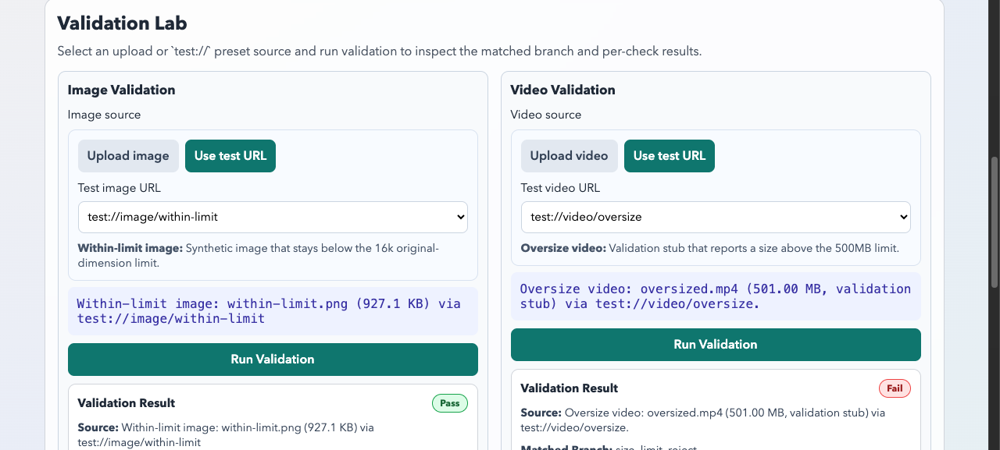
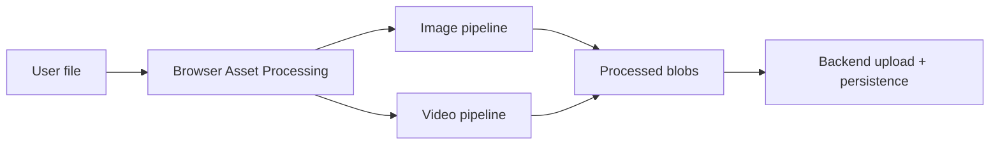
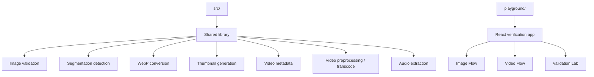
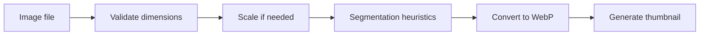

# Browser Asset Processing

Browser-side media preprocessing for images and videos.

This repo moves selected asset-processing work out of the backend and into the browser so clients can reject bad files earlier, normalize outputs before upload, and reduce avoidable backend work.



## What It Does

- validates image and video files before upload
- scales oversized images to backend-compatible limits
- detects segmentation-related image signals
- converts images to WebP and generates thumbnails
- extracts video metadata, thumbnails, audio, and optional transcodes
- provides a local playground for manual verification

## What Stays On The Backend

- storage and database writes
- queue publishing and async orchestration
- segmentation dispatch
- embeddings and speech-to-text
- downstream finalization steps

## Architecture





## Processing Flows




## Repo Layout

```text
src/                 Shared TypeScript library
src/lib/             Processing modules
src/types/           Shared types and backend-mirrored constants
src/__tests__/       Vitest coverage
playground/          React manual test app
playground/src/App.tsx
                     Playground UI
playground/src/test-media.ts
                     Deterministic test:// validation sources
```

## Quick Start

```bash
npm install
npm run dev
```

Useful commands:

```bash
npm run build
npm run build:playground
npm run typecheck:lib
npm run typecheck:playground
npm test
```

## Public API

Entrypoint: `src/index.ts`

Key exports:

- image: `validateImageDimensions`, `isSegmentedImage`, `detectWhiteBackground`, `convertToWebP`, `generateThumbnail`
- video: `validateVideoFile`, `extractVideoAttributes`, `preprocessVideo`, `transcodeVideo`, `trimVideo`, `extractAudioTrack`, `hasAudioTrack`
- orchestration: `processProductAsset`, `processVideoAsset`
- shared: `CONFIG`, `IsProductType`, shared result types

## Playground

The playground is the fastest way to inspect real browser behavior.

Sections:

- `Image Flow`: full product-asset pipeline
- `Video Flow`: validation, preprocess, transcode, audio extraction
- `Validation Lab`: source-driven validation UI for image and video

Validation Lab behavior:

- each column has one source picker
- user chooses upload mode or `test://` preset mode
- user clicks one `Run Validation` button
- result shows matched branch and check outcomes

## Backend Parity

This repo mirrors selected logic from the Python asset-processing backend. Backend-compatible limits live in `src/types/index.ts`.

Important values:

- `VALID_IMAGE_DIMENSION_LIMIT = 25000`
- `ORIGINAL_IMAGE_DIMENSION_LIMIT = 16000`
- `WEBP_MAX_DIMENSION = 16000`
- `SCALED_IMAGE_DIMENSION_LIMIT = 4096`
- `THUMBNAIL_MAX_WIDTH = 300`
- `THUMBNAIL_MAX_HEIGHT = 300`

## Browser Notes

- Chromium-based browsers are the most reliable verification environment
- some media APIs are less consistent in Safari and Firefox
- large files are memory-sensitive because several flows materialize decoded frames or `ImageData`
