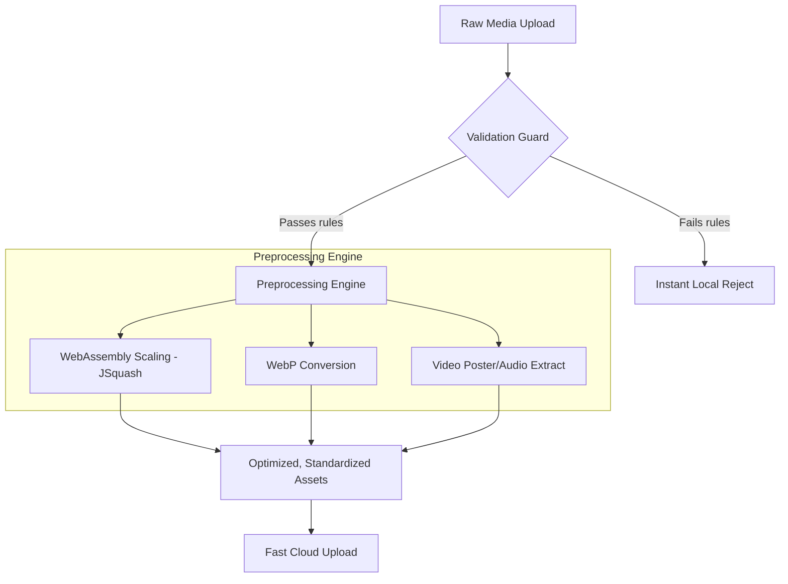

# Client-Side Media Processor ⚙️

An ultra-high performance, WebAssembly-powered client-side media preprocessing, normalization, and validation pipeline. This library offloads computationally heavy media processing tasks directly into the user's browser, enabling fast local validation and file transformation before uploading to cloud storage.

## 🚀 Key Features

- **WebAssembly-Accelerated Conversions:** Leverages high-performance WebAssembly builds (via `@jsquash` modules) to encode and decode images (PNG/JPEG/WebP) directly in browser threads.
- **Pre-Upload Normalization:** Instantly downscales oversized images, compresses them, and transcodes them into web-optimized WebP formats and generates high-fidelity thumbnails.
- **Early-Fail File Validation:** Validates aspect ratios, minimum resolutions, file corruptions, and format specifications locally—rejecting problematic files instantly before utilizing network bandwidth.
- **Video Preprocessing:** Integrates `mediabunny` under-the-hood to extract video metadata, duration, frame rates, and extract poster frames or audio tracks client-side.
- **Interactive Validation Playground:** Includes an intuitive, feature-packed local developer environment ("Validation Lab") to test custom file schemas, rules, and export performance in real-time.

## 🛠️ System Architecture



## 📦 Tech Stack

- **WASM Modules:** `@jsquash/webp`, `@jsquash/png`, `@jsquash/jpeg`, `@jsquash/resize`
- **Video Processing:** `mediabunny` (Client WebAssembly-based FFmpeg wrappers)
- **Framework & Tests:** React 18, TypeScript, Vitest (Unit & integration testing)
- **Bundler:** Vite

## ⚙️ Setup & Installation

```bash
# Clone and enter directory
git clone https://github.com/KhoaTheBest/client-side-media-processor.git
cd client-side-media-processor

# Install dependencies
npm install

# Start local playground server
npm run dev

# Run high-coverage unit tests
npm run test
```

## 💡 Engineering Highlights & Optimizations

- **WASM Thread Optimization:** Instantiates WebAssembly modules dynamically to ensure fast initial page loading times, downloading WASM binaries asynchronously on demand.
- **Flat Server Workloads:** Dispatches processing tasks client-side, reducing server-side video/image transcoding infrastructure overhead by up to 90%.
